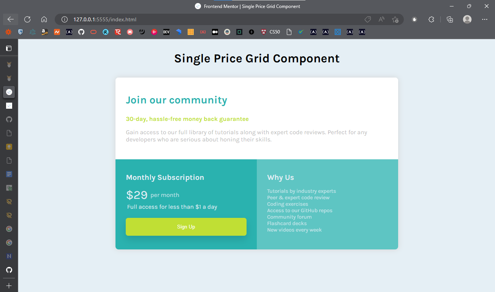
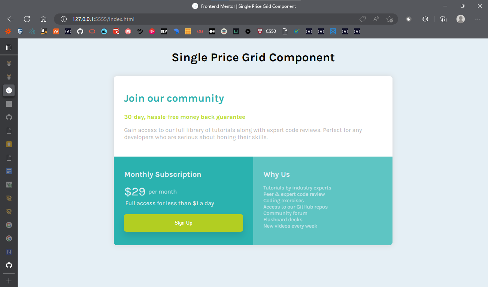
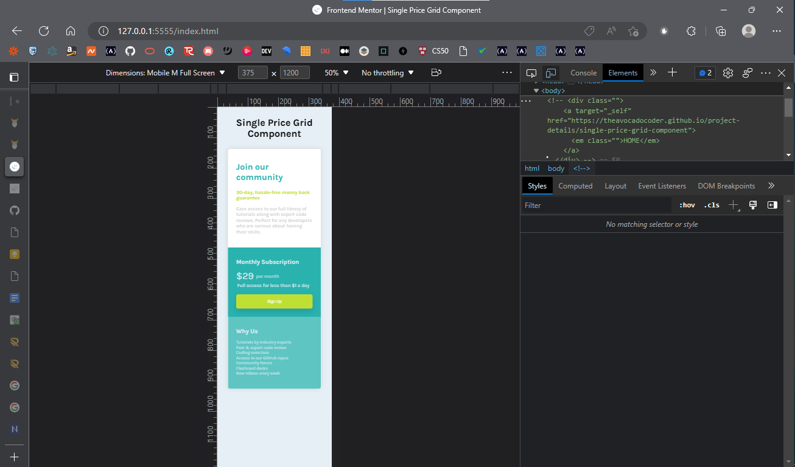

# Frontend Mentor - Single price grid component solution

This is a solution to the [Single price grid component challenge on Frontend Mentor](https://www.frontendmentor.io/challenges/single-price-grid-component-5ce41129d0ff452fec5abbbc). Frontend Mentor challenges help you improve your coding skills by building realistic projects. 

## Table of contents

- [Overview](#overview)
  - [The challenge](#the-challenge)
  - [Screenshots](#screenshots)
  - [Links](#links)
- [My process](#my-process)
  - [Built with](#built-with)
  - [What I learned](#what-i-learned)
  - [Continued development](#continued-development)
  - [Useful resources](#useful-resources)
- [Author](#author)

## Overview

### The challenge

Users should be able to:

- View the optimal layout for the component depending on their device's screen size
- See a hover state on desktop for the Sign Up call-to-action

### Screenshots

### Links

- Solution URL: [Github Repo](https://github.com/theAvocadoCoder/single-price-grid-component)
- Live Site URL: [Single Price Grid Component](https://theavocadocoder.github.io/single-price-grid-component)

## My process

### Built with

- Semantic HTML5 markup
- CSS Grid

### What I learned

In my first attempt of this project, I used a CSS framework (TailwindCSS) and Flexbox. While it was interesting to work with, it defeated the point of the assignment which was to use Grid layout. Thankfully, a helpful user pointed this error to me when I initially submitted.

I also learned, in my first attempt, how to include Google Fonts in my project.

I learned how CSS Grid works and that gave me the confidence I lacked to approach the project. I learned about explicit and implicit grid tracks, the auto-fit and auto-fill keywords, the repeat function and the minmax function during this project.

What was most useful to me was learning how auto-fit and the repeat function work together to create dynamic grids, especially when used in conjunction with the minmax function. This helped me make the grid responsive without needing to use media queries.

### Continued development

I had been of the opinion that grids were not flexible like flex containers. I am happy to have learned that this is not the case at all. I hope to continue practicing with CSS grid so I am more confident in applying it.

I would like to do further reading on default styling of elements. I noticed that my lack of familiarity with the elements' default styling led to lots of time being spent trying to figure out why a certain style isn't giving the desired result.

### Useful resources

- [DevDocs](https://devdocs.io/) - I believe this to be one of the most powerful resources currently in my arsenal. It is chuck full of documentation on most programming languages, libraries and frameworks. Plus, it works offline and on mobile.
- [Hatchet article](https://hatchet.com.au/blog/how-to-use-google-fonts-in-tailwind-css/) - This article taught me how to include the Google Font needed for the project.
- [The Odin Project](https://theodinproject.com/) - I learned about CSS grids by following the course on The Odin Project.

## Author

- Website - [theAvocadoCoder](https://theavocadocoder.github.io)
- Frontend Mentor - [@theAvocadoCoder](https://www.frontendmentor.io/profile/theAvocadoCoder)
- Twitter - [@theAvocadoCoder](https://www.twitter.com/theAvocadoCoder)
